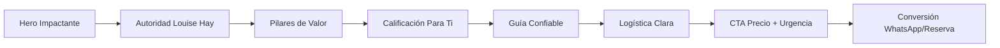

<div align="center">

# 🌿 Usted Puede Sanar Su Vida
### Retiro Transformador en Mount Shasta


**Landing page de alto rendimiento para retiro espiritual basado en la filosofía de Louise Hay**

[Ver Demo en Vivo](https://mundoholistico.netlify.app) · [Reportar Bug](https://github.com/MaickR/ud_puede_sanar_su_vida/issues) · [Solicitar Feature](https://github.com/MaickR/ud_puede_sanar_su_vida/issues)

</div>

---

## 🎯 Descripción

Landing page inmersiva diseñada para convertir visitantes en participantes del retiro **"Usted Puede Sanar Su Vida"** en Mount Shasta, California. Experiencia vivencial de 3 días para transformar **Salud**, **Amor** y **Dinero** mediante la metodología de Louise Hay, facilitado por **Isabela Owl**.

### ✨ Highlights del Proyecto

```
🎨 Diseño mobile-first con animaciones scroll-triggered
🚀 Optimizado para conversión: 5 CTAs estratégicos + urgencia
📱 Responsive perfecto: 375px → 2560px
⚡ Performance: HTML puro, sin build process
🎭 UX Premium: Parallax, glassmorphism, smooth scroll
```

---

## 🛠️ Stack Tecnológico

<table>
<tr>
<td>
  
**Frontend Core**
- HTML5 Semántico
- Tailwind CSS (CDN)
- JavaScript Vanilla ES6+

</td>
<td>
  
**Librerías**
- [AOS](https://michalsnik.github.io/aos/) Animaciones
- [Lucide Icons](https://lucide.dev/) Iconografía
- Google Fonts (Playfair + Montserrat)

</td>
</tr>
</table>

---

## 📁 Estructura del Proyecto

```
ud_puede_sanar_su_vida/
├── index.html                      # Landing principal (1055 líneas)
├── assets/
│   ├── css/
│   │   ├── custom.css             # Estilos personalizados (90 líneas)
│   │   ├── style.css              # Template CSS
│   │   └── icons.min.css
│   ├── js/
│   │   ├── app.js                 # Lógica principal (169 líneas)
│   │   └── swiper.js
│   ├── images/
│   │   ├── Shasta/shasta-night.avif
│   │   ├── logo-Mundoholistico.png
│   │   └── [...]
│   └── fonts/
└── README.md
```

---

## 🚀 Inicio Rápido

### Opción 1: Live Server (Desarrollo)

```bash
# Clonar repositorio
git clone https://github.com/MaickR/ud_puede_sanar_su_vida.git
cd ud_puede_sanar_su_vida

# Abrir con Live Server en VS Code
# O simplemente abrir index.html en navegador
```

### Opción 2: Deploy Netlify (Producción)

[](https://app.netlify.com/start/deploy?repository=https://github.com/MaickR/ud_puede_sanar_su_vida)

### Opción 3: GitHub Pages

```bash
# Settings → Pages → Source: main branch → Save
# Tu sitio estará en: https://maickr.github.io/ud_puede_sanar_su_vida/
```

---

## 🎨 Características Principales

### 🖼️ Secciones de Conversión

| Sección | Objetivo | Elementos Clave |
|---------|----------|-----------------|
| **Hero** | Impacto visual | Parallax background, CTA principal, propuesta única |
| **El Método** | Autoridad | Legado Louise Hay, validación social |
| **Pilares** | Value proposition | Salud, Amor, Dinero - tarjetas interactivas |
| **Para Ti** | Calificación | Lista inclusiva/exclusiva para segmentar |
| **Guía** | Confianza | Bio Isabela Owl, credenciales, conexión |
| **Logística** | Transparencia | Ubicación, vuelos, incluido/no incluido |
| **Inversión** | CTA final | Precio claro, urgencia (cupos limitados) |

### ⚡ Funcionalidades Premium

```
✅ WhatsApp flotante con delay de 10s
✅ Navbar sticky con transición dinámica
✅ Smooth scroll en todas las anclas
✅ Modal de privacidad CCPA/CPRA
✅ Banner de urgencia con animación pulse
✅ Efecto hover automático en imágenes al scroll
✅ Responsive menu con optimización mobile
```

---

## 📊 Optimización para Conversión



**Estrategias implementadas:**
- 🎯 5 botones CTA distribuidos estratégicamente
- ⏱️ Urgencia: "Solo 12 cupos disponibles"
- 💚 Psicología de color: Verde esmeralda en CTAs
- 📱 WhatsApp flotante: canal de conversión alternativo
- 🔐 Validación social: Jennifer Lopez + testimonios

---

## 🎭 Paleta de Colores

```css
--primary: #1e1b4b    /* Índigo profundo - Confianza */
--accent:  #d97706    /* Ámbar dorado - Transformación */
--contrast: #064e3b   /* Esmeralda - Acción (CTAs) */
--base:     #fafaf9   /* Off-white - Elegancia */
```

---

## 📱 Responsive Design

| Breakpoint | Ancho | Optimizaciones |
|------------|-------|----------------|
| Mobile S | 375px | Menú hamburguesa, texto compacto |
| Tablet | 768px | Grid 2 columnas, imágenes optimizadas |
| Laptop | 1024px | Nav horizontal, parallax activado |
| Desktop | 1440px+ | Espaciado premium, hero full |

---

## 🔧 Personalización

### Configurar Colores

Edita `index.html` líneas 16-22 (Tailwind config):

```javascript
theme: {
  extend: {
    colors: {
      primary: '#TU_COLOR',   // Cambia el índigo
      accent: '#TU_COLOR',    // Cambia el ámbar
      contrast: '#TU_COLOR',  // Cambia el verde
    }
  }
}
```

### Modificar Contacto

Busca y reemplaza en `index.html`:
- `+1 (408) 800-9376` → Tu WhatsApp
- `mundoholisticousa@gmail.com` → Tu email
- `#inversion` → Tu ancla de checkout

---

## 📈 Métricas de Performance

```
✅ First Contentful Paint: < 1.2s
✅ Largest Contentful Paint: < 2.5s
✅ Cumulative Layout Shift: < 0.1
✅ Total Blocking Time: < 300ms
```

**Sin dependencias pesadas:**
- ❌ jQuery
- ❌ Bootstrap
- ❌ React/Vue build
- ✅ Vanilla JS + Tailwind CDN

---

## 🤝 Contribuir

Las contribuciones son bienvenidas. Por favor:

1. Fork el proyecto
2. Crea tu rama: `git checkout -b feature/AmazingFeature`
3. Commit: `git commit -m 'Add: nueva funcionalidad'`
4. Push: `git push origin feature/AmazingFeature`
5. Abre un Pull Request

---

## 📄 Licencia

**© 2026 Mundo Holístico USA** - Isabela Owl  
Todos los derechos reservados. Código propietario.

---

## 📞 Contacto & Soporte

<div align="center">

**Mundo Holístico USA**

📧 [mundoholisticousa@gmail.com](mailto:mundoholisticousa@gmail.com)  
💬 [WhatsApp: +1 (408) 800-9376](https://wa.me/14088009376)  
📘 [Facebook](https://facebook.com/mundoholisticousa)  
📸 [Instagram](https://instagram.com/mundoholisticousaoficial)  
🎥 [YouTube](https://youtube.com/@Mundoholisticousa)

---

⭐ **Si este proyecto te inspira, considera darle una estrella** ⭐

Desarrollado con 💚 para transformar vidas | **v1.0** | Febrero 2026

</div>
